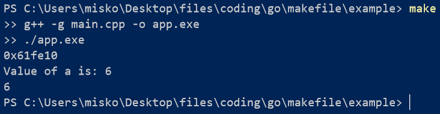

# WindowsMakefile

## About

Simple makefile copy for windows with not all features but it can be used for languages like c++ and c. If you want to know how to use it, there is example in this repository.

## Setup

1. Open control panel. 

2. Search env. 

3. Click edit the system enviroment variables then click enviroment variables. 

4. Under user variables for user (your user name) double click variable Path. 

5. Click new and there add the location of your directory where the exe is located. I recommend you naming that exe make.exe so you can run the command `make` (you need to build the main.go file by running command `go build`).

